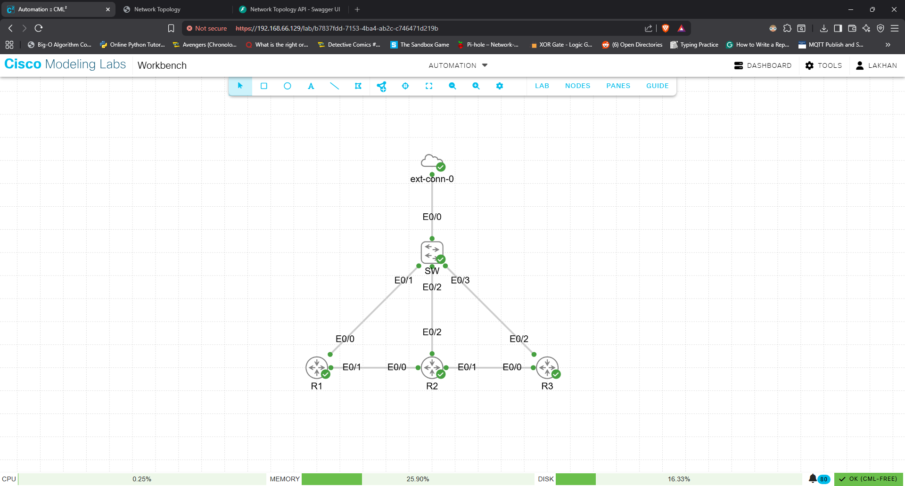

# REST API-Driven Network Topology Discovery Tool

A Python-based network automation tool that automatically discovers lab topology by walking CDP neighbors via SSH (Netmiko), builds a graph of device adjacencies (NetworkX), exposes it through a REST API (FastAPI), and renders an interactive browser-based topology map (Vis.js).

Built and tested on a Cisco CML free-tier lab (IOSv, IOS XE 17.16.1a) with a Windows 11 host.

---

## Table of Contents

- [Project Overview](#project-overview)
- [Architecture](#architecture)
- [Lab Topology](#lab-topology)
- [Tools and Stack](#tools-and-stack)
- [Project Structure](#project-structure)
- [Environment Setup](#environment-setup)
- [CML Lab Setup](#cml-lab-setup)
- [Configuration](#configuration)
- [Running the Project](#running-the-project)
- [API Endpoints](#api-endpoints)
- [Errors Encountered and Fixes](#errors-encountered-and-fixes)
- [What I Learned](#what-i-learned)

---

## Project Overview

Manual topology documentation is a time-consuming, error-prone task in network operations. This tool eliminates that by:

1. SSHing into seed devices defined in an inventory file
2. Running `show cdp neighbors detail` and parsing the output
3. Walking discovered neighbors recursively to map the full topology
4. Storing the adjacency graph as JSON
5. Serving it via a REST API
6. Rendering an interactive, clickable topology map in the browser

**Outcome:** Full topology discovered and visualized in under 10 seconds across a 3-router lab replacing what would otherwise require manual CLI inspection of every device.

---

## Architecture

```
inventory.yaml
      |
      v
 collector.py  <----SSH (Netmiko)---->  CML Lab (R1, R2, R3)
      |                                  CDP neighbors detail
      v
  graph.py  (NetworkX + JSON)
      |
      v
   api.py  (FastAPI)
      |
      v
static/topology.html  (Vis.js interactive map)
```

**Data flow:**
- `collector.py` SSHes into seed devices, parses CDP output, recursively queues newly discovered neighbors
- `graph.py` builds a NetworkX graph and serializes to `data/topology.json`
- `api.py` serves the graph via REST and triggers rediscovery on demand
- `topology.html` fetches the API and renders nodes/edges interactively

---

## Lab Topology



```
[Windows Host 192.168.66.1]
          |
   [VMware VMnet1]
          |
  [External Connector]
          |
   [Unmanaged Switch]
     /    |    \
   R1    R2    R3
 .66.10 .66.11 .66.12   <- management (Eth0/2 on R2/R3, Eth0/0 on R1)
   |      |      |
  Eth0/1-Eth0/0 Eth0/1-Eth0/0   <- transit links (10.0.12.x, 10.0.23.x)
```


**Device summary:**

| Device | Mgmt Interface | Mgmt IP | Transit Links |
|--------|---------------|---------|---------------|
| R1 | Ethernet0/0 | 192.168.66.10 | Eth0/1 → R2 Eth0/0 (10.0.12.1/2) |
| R2 | Ethernet0/2 | 192.168.66.11 | Eth0/0 → R1, Eth0/1 → R3 (10.0.23.1/2) |
| R3 | Ethernet0/2 | 192.168.66.12 | Eth0/0 → R2 |


---

## Tools and Stack

| Tool | Version | Purpose |
|------|---------|---------|
| Python | 3.10+ | Core language |
| Netmiko | 4.3.0 | SSH to Cisco IOS devices |
| NetworkX | 3.3 | Graph modeling and adjacency storage |
| FastAPI | 0.111.0 | REST API server |
| Uvicorn | 0.30.1 | ASGI server for FastAPI |
| PyYAML | 6.0.1 | Inventory file parsing |
| Vis.js | 4.21.0 | Browser-based interactive topology map |
| CML Free | - | Lab simulation (3x IOSv routers) |
| VMware Workstation | - | VMnet1 host-only bridge to CML |

---

## Project Structure

```
topology-discovery/
├── inventory.yaml        # Seed devices for SSH
├── collector.py          # CDP walker via Netmiko
├── graph.py              # NetworkX graph builder + JSON serializer
├── api.py                # FastAPI REST server
├── static/
│   └── topology.html     # Vis.js interactive frontend
├── data/
│   └── topology.json     # Auto-generated topology (git-ignored)
└── requirements.txt
```

---

## Environment Setup

### Requirements

```
netmiko==4.3.0
fastapi==0.111.0
uvicorn==0.30.1
pyyaml==6.0.1
networkx==3.3
```

### Windows setup

```bash
mkdir "C:\projects\topology-discovery"
cd "C:\projects\topology-discovery"
python -m venv venv
venv\Scripts\activate
pip install -r requirements.txt
mkdir data
mkdir static
```

---

## CML Lab Setup

### Router base config (repeat on R1, R2, R3)

```
hostname R1
ip domain-name lab.local
crypto key generate rsa modulus 2048
ip ssh version 2
username admin privilege 15 secret cisco123
cdp run
line vty 0 4
 login local
 transport input ssh
```

### R1 interfaces

```
interface Ethernet0/0
 description MGMT
 ip address 192.168.66.10 255.255.255.0
 cdp enable
 no shutdown

interface Ethernet0/1
 description link-to-R2
 ip address 10.0.12.1 255.255.255.252
 cdp enable
 no shutdown
```

### R2 interfaces

```
interface Ethernet0/0
 description link-to-R1
 ip address 10.0.12.2 255.255.255.252
 cdp enable
 no shutdown

interface Ethernet0/1
 description link-to-R3
 ip address 10.0.23.1 255.255.255.252
 cdp enable
 no shutdown

interface Ethernet0/2
 description MGMT
 ip address 192.168.66.11 255.255.255.0
 no shutdown
```

### R3 interfaces

```
interface Ethernet0/0
 description link-to-R2
 ip address 10.0.23.2 255.255.255.252
 cdp enable
 no shutdown

interface Ethernet0/2
 description MGMT
 ip address 192.168.66.12 255.255.255.0
 no shutdown
```

### CML external connector

- Node type: **External Connector**
- Bridge: **VMnet1** (VMware host-only adapter, `192.168.66.1` on Windows host)
- Connected to an **Unmanaged Switch** node
- Switch connects to: R1 Eth0/0, R2 Eth0/2, R3 Eth0/2

---

## Configuration

### inventory.yaml

```yaml
devices:
  - hostname: R1
    host: 192.168.66.10
    device_type: cisco_ios
    username: admin
    password: cisco123

  - hostname: R2
    host: 192.168.66.11
    device_type: cisco_ios
    username: admin
    password: cisco123

  - hostname: R3
    host: 192.168.66.12
    device_type: cisco_ios
    username: admin
    password: cisco123
```

---

## Running the Project

### 1. Verify SSH reachability

```bash
ssh admin@192.168.66.10
ssh admin@192.168.66.11
ssh admin@192.168.66.12
```

### 2. Test collector standalone

```bash
python graph.py
```

Expected output:
```
[INFO] Scanning R1 (192.168.66.10)
[INFO] Scanning R2 (192.168.66.11)
[INFO] Scanning R3 (192.168.66.12)
[OK] 4 nodes, 5 edges saved.
```

### 3. Start API server

```bash
uvicorn api:app --reload --host 0.0.0.0 --port 8000
```

### 4. Open in browser

- **Topology UI:** `http://localhost:8000`
- **API docs (Swagger):** `http://localhost:8000/docs`

Click **Rediscover** to trigger a live CDP walk and render the map. Click any node to inspect its IP, platform, and neighbor list.

---

## API Endpoints

| Method | Endpoint | Description |
|--------|----------|-------------|
| GET | `/` | Serves the topology UI |
| GET | `/api/topology` | Returns full topology JSON (nodes + edges) |
| POST | `/api/discover` | Triggers live CDP walk and rebuilds graph |
| GET | `/api/nodes/{node_id}` | Returns details and neighbors for a single node |

### Example: POST /api/discover response

```json
{
  "status": "ok",
  "nodes": 4,
  "edges": 5
}
```

### Example: GET /api/nodes/R1 response

```json
{
  "id": "R1",
  "label": "R1",
  "ip": "unknown",
  "platform": "Linux Unix",
  "neighbors": ["R2"]
}
```

---

## Errors Encountered and Fixes

### 1. SSH timeout to R2 (10.0.12.2)

**Error:**
```
[WARN] R2: TCP connection to device failed.
Device settings: cisco_ios 10.0.12.2:22
```

**Cause:** CDP discovered R2 via its transit link IP (`10.0.12.2`), which is not reachable from the Windows host  only the management subnet (`192.168.66.x`) is routed through VMnet1.

**Fix:** Added dedicated management interfaces on R2 (`Eth0/2 192.168.66.11`) and R3 (`Eth0/2 192.168.66.12`), then updated `inventory.yaml` with management IPs.

---

### 2. External Connector only has one interface

**Problem:** Needed to connect R1, R2, and R3 all to the external connector for management access, but CML's External Connector node only exposes one interface.

**Fix:** Added an **Unmanaged Switch** node between the External Connector and the three routers. External Connector → Switch → R1/R2/R3. This acts as a Layer 2 hub for the management subnet.

---

### 3. Wrong bridge on External Connector (192.168.100.x mismatch)

**Problem:** Initial config used `192.168.100.x` for management IPs, but Windows host VMware adapters were on `192.168.66.x` (VMnet1) and `192.168.254.x` (VMnet8). Ping to `192.168.100.10` timed out.

**Fix:** Changed External Connector bridge from `bridge0` to **VMnet1**, and reconfigured R1's management IP to `192.168.66.10` to match the VMnet1 subnet.

---

### 4. device_type mismatch

**Problem:** Tested `cisco_xe` as device type in Netmiko for IOS XE 17.16.1a  connection succeeded but command parsing behaved unexpectedly.

**Fix:** Used `cisco_ios` as the Netmiko device type, which works correctly for both IOS and IOS XE in this context.

---

## What I Learned

- **CDP as a discovery protocol:** `show cdp neighbors detail` provides enough structured data (device ID, interface, IP, platform) to fully reconstruct a topology graph without any SNMP or APIs.
- **Recursive neighbor walking:** Seeding with one device and queuing newly discovered neighbors enables full topology discovery without manually listing every device  scales naturally to larger labs.
- **NetworkX for network graphs:** Modeling topology as a graph object (nodes + edges with attributes) makes it trivial to query neighbors, detect isolated nodes, and serialize to standard formats.
- **FastAPI auto-documentation:** The `/docs` Swagger UI is generated automatically from endpoint definitions  useful for demoing the API to interviewers without any extra work.
- **VMware bridging for CML lab access:** CML runs inside a VM and its External Connector maps to the hypervisor's virtual adapters (VMnet1/VMnet8), not the Windows physical NICs. Host-only (VMnet1) is the cleanest choice for isolated lab management networks.
- **Management plane separation:** Transit link IPs (point-to-point /30s) are not reachable from the host. Dedicated management interfaces on a shared subnet are required for out-of-band tool access  mirrors real enterprise OOB design.

---

## Author

Lakhan Kumar Sunilkumar
MS Computer Science, UC Riverside | CCNA 200-301
lakumar0609@gmail.com | (951) 512-3416
